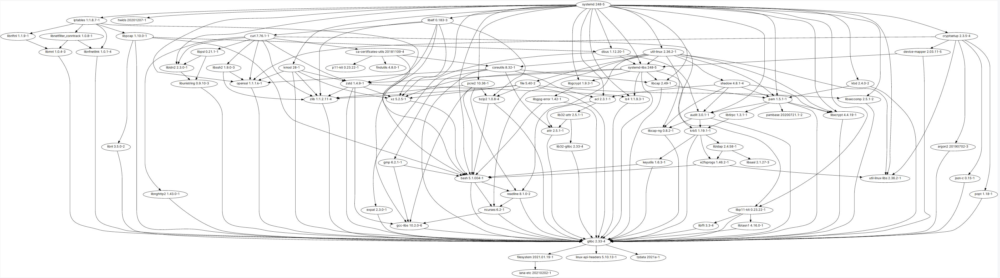

# Archer - a repository builder for ArchLinux

> This project is at a very early stage.

## Current Progress

### Naive Dependency Resolving

## Todos
- [ ] dependency resolving
  + [x] dfs search (find dependency closure)
  + [x] graph output (via petgraph)
  + [ ] skip policy (ignore packages existing in certain repo)
  + [ ] topo sort
  + [ ] support for makedepends
  + [x] batch query
  + [x] parallel query for aur
  + [ ] custom pkgbuild support
- [ ] build environment setup
  + [ ] bare metal
  + [ ] bubblewrap
  + [ ] official container buildtools
- [ ] build workflow
  + [ ] error handling
- [ ] storage support
  + [ ] file
  + [ ] aliyun oss
  + [ ] s3
- [ ] update checker
  + [ ] support for vcs packages
- [ ] metadata & build report (json, plain)
  + [ ] basic functionality
  + [ ] frontend (optional)